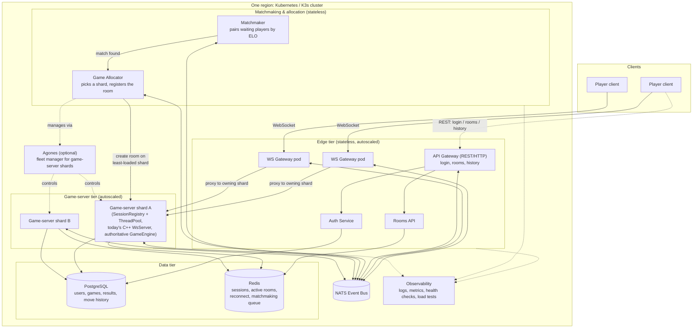

# Server Design — Scaling Kung Fu Chess to Internet Scale

Week-6 (CTD) assignment: design (not yet implement) a version of the server
that could plausibly support **100M registered users** and **10M concurrent
players**, using Docker/Kubernetes as the deployment unit. This document
answers the four questions from the assignment, plus the required
Docker/K3s/Kubernetes background, and ends with a phased plan for what to
actually build this week on top of the current single-process C++ server.

## 0. Where we start from

Today: one process, one `SessionRegistry` holding every room in an
in-memory `unordered_map`, one shared `ThreadPool` for tick computation, one
SQLite file for accounts/ELO. That's correct for "a server that works," but
every one of those nouns ("one process," "in-memory map," "one SQLite
file") is exactly the thing that has to change to survive 10M concurrent
players. The rest of this doc is about what replaces each of them.

## 1. Docker / Kubernetes / K3s — what they are, in one paragraph each

- **Docker**: packages the app + its runtime dependencies into one
  immutable image, so "works on my machine" becomes "works anywhere
  Docker/a Docker-compatible runtime runs." The unit of deployment becomes
  a *container*, not a machine.
- **Kubernetes (K8s)**: an orchestrator that takes a fleet of machines
  (nodes) and a declarative spec ("I want N copies of this image, this much
  CPU/RAM, restart on crash, expose this port") and makes reality match the
  spec continuously — reschedules pods off a dead node, scales replica
  count up/down (HPA) based on load, does rolling deploys, service
  discovery, etc. It's built for stateless-ish, horizontally-scaled
  workloads; stateful things (DBs) need extra primitives (`StatefulSet`,
  `PersistentVolume`).
- **K3s**: a single ~70MB binary that *is* a certified, spec-compliant
  Kubernetes distribution, just stripped of legacy/alpha features and
  bundled with a lighter default datastore (SQLite instead of etcd for
  single-node setups). Same API, same manifests, far less to install/run —
  good for edge nodes, dev clusters, or a CTD student's laptop; not
  something to justify choosing *over* full K8s for a real 10M-user
  production fleet, since at that scale you want etcd's multi-master HA
  anyway. For this project: K3s is how we'd *practice* the K8s workflow
  locally; the design below assumes real K8s (or a managed equivalent —
  EKS/GKE) in production.

Sources: [K3s vs K8s — CloudOptimo](https://www.cloudoptimo.com/blog/k3s-vs-k8s-lightweight-vs-full-featured-kubernetes-distributions/), [What is K3s — Devtron](https://devtron.ai/what-is-k3s), [Kubernetes vs Docker Swarm — Dash0](https://www.dash0.com/comparisons/kubernetes-vs-docker-swarm-pros-cons-and-6-key-differences)

**Why Kubernetes over Docker Swarm here specifically**: Swarm is simpler
but its autoscaling is closer to "restart a dead container" than real
metric-driven horizontal scaling, and it has no first-class answer for
persistent, multi-host stateful storage. At 10M-concurrent scale we need
both (autoscale the stateless gateway/game-server tiers, and run the DB
tier as a proper `StatefulSet` or managed service) — so Kubernetes is the
industry-standard answer, and it's also simply the one interviewers expect.

## 2. Question 1 — DB for 100M registered users: is SQLite enough?

**No.** SQLite is a single **file**, accessed by a single **process** (or
a small number on the same machine with heavy lock contention). It has no
concept of a network protocol, no replication, no sharding, and effectively
one writer at a time. The moment there's more than one app server —
which there has to be, for 10M concurrent connections — every one of them
would need direct filesystem access to the same file, which doesn't work
across machines. SQLite is the right choice for *this project today*
(single process, low user count) and the wrong choice the moment "server"
stops meaning "one process."

**What replaces it**: a real client-server DB, reachable over the network,
that can be **sharded** (data split across many instances) and
**replicated** (each shard has standby copies for durability/read scaling).
Concretely:

- **User accounts / credentials / ELO**: this data is simple,
  key-lookup-shaped (fetch by username or user ID, no complex joins across
  users) and needs strong consistency for things like ELO updates and
  unique usernames. That profile fits a **sharded relational DB**
  (Postgres/MySQL, sharded by `hash(user_id)` across, say, a few hundred
  shards, using something like Vitess/Citus to make the sharding
  transparent to the app) at least as well as a NoSQL store, and keeps
  ACID guarantees for the ELO read-modify-write. An alternative that's
  equally defensible in an interview: a wide-column/key-value store
  (DynamoDB, Cassandra) if we're willing to give up cross-shard
  transactions in exchange for effectively unlimited horizontal write
  scale with no manual resharding.
- **Session/presence state** ("which server is this user connected to
  right now," "which room are they in") — this is small, ephemeral,
  extremely hot, and doesn't need durability across a restart. This
  belongs in **Redis** (in-memory, sharded via Redis Cluster), not the
  user DB.
- **Match history / analytics / logs** — high write volume, no need for
  strong consistency, read patterns are "recent N by user" or
  aggregate — a good fit for Cassandra or a managed equivalent
  (DynamoDB), separate from the accounts DB so its write load never
  competes with login/account traffic.

So: **one system, three different data stores**, each picked for its
access pattern, not one universal DB.

Sources: [Sharding for system design interviews — dev.to](https://dev.to/somadevtoo/database-sharding-for-system-design-interview-1k6b), [SQL vs NoSQL — designgurus](https://designgurus.substack.com/p/every-database-and-caching-concept), [Scaling to 10M users — MockExperts](https://www.mockexperts.com/blog/system-design-scaling-10m-users-senior-roles-2026)

## 3. Question 2 — 10M concurrent players: one server enough? How do rooms/servers relate?

One server is nowhere close to enough — see the bandwidth math in Q3, and
even ignoring bandwidth, 10M held-open WebSocket connections plus 10M/2s
game-step computations is far beyond one machine's memory/CPU. We need
**many stateless-ish game-server pods**, fronted by a routing layer, plus
a small number of shared coordination services. Roles:

- **Edge/Gateway tier** (many replicas, autoscaled): terminates
  WebSocket/TLS connections from clients, does auth, and — this is the key
  part — figures out *which backend pod actually owns the room the client
  wants* and either proxies the connection there or hands the client that
  pod's address to connect to directly. This is the generalization of
  today's single in-memory `SessionRegistry`: it becomes a **shared,
  networked room directory** (Redis, or a small dedicated directory
  service) mapping `roomName → pod ID / address`, instead of a
  process-local `unordered_map`.
- **Game-server tier** (many replicas, autoscaled, this is our current
  C++ `WsServer` process): each pod owns some subset of rooms in memory
  (its own local `SessionRegistry`+`ThreadPool`, basically today's code
  unmodified) and runs their ticks. A room lives entirely on **one** pod
  at a time — we don't try to distribute a single room's simulation across
  machines, that's not a problem this scale needs solved.
- **Matchmaking tier** (small number of stateless workers): when two
  players want a game, matchmaking doesn't care which pod will host it —
  it picks *any* game-server pod with capacity (e.g. via the directory
  service or a simple least-loaded selection), asks it to create the room,
  then registers `roomName → that pod` in the directory. This is how
  "everyone can play with everyone" works despite rooms being scattered
  across hundreds of pods: nobody needs to know the *topology*, only the
  directory. A player joining an existing room by name goes through the
  same directory lookup — the gateway asks "who owns room X," gets an
  answer, and connects them there.
- **Why not sticky-session-only, no directory**: sticky sessions (route by
  client IP/cookie back to the same backend) solve "reconnect to the pod
  you're already talking to," but they don't solve "two players from
  opposite sides of the world both need to reach the *same* room's pod."
  The directory is what makes cross-pod room lookup possible at all;
  sticky routing is complementary (nice for gateway-tier load balancer
  affinity) but not sufficient on its own.
- **Cross-pod broadcast**: because a room is fully owned by one pod, this
  project doesn't need a Redis-pub/sub broadcast-to-all-pods fan-out the
  way a shared-world MMO would — a much simpler design than "every server
  needs every message." That fan-out pattern only becomes necessary if a
  single game world/room must span multiple processes, which isn't our
  case.

Sources: [Rooms, Instances, and Shards — Supercraft](https://crux.supercraft.host/blog/game-server-rooms-instances-scaling/), [WebSockets at Scale](https://websocket.org/guides/websockets-at-scale/), [Scaling WebSocket Connections — dev.to](https://dev.to/young_gao/scaling-websocket-connections-from-single-server-to-distributed-architecture-1men), [Sticky sessions vs distributed state](https://scalewithchintan.com/blog/websocket-scaling-sticky-sessions-vs-distributed-state)

## 4. Question 3 — bandwidth of one move every ~2s

Rough order-of-magnitude, not a precise measurement:

- A move message (JSON payload + WebSocket framing) is on the order of
  **~150–200 bytes**.
- 10,000,000 concurrent active players, one action every 2s on average →
  **5,000,000 actions/sec** arriving at the fleet.
- **Inbound**: 5,000,000 × ~170 B ≈ **850 MB/s ≈ ~6.8 Gbps**.
- **Outbound** is bigger: each action has to be broadcast to the other
  occupant(s) of that room (opponent + any spectators). Even a
  conservative ~2× fan-out gives 10,000,000 × ~170 B ≈ **1.7 GB/s ≈ ~13.6
  Gbps**.
- **Total ≈ 20+ Gbps**, sustained, and that's before adding join/leave
  events, chat, matchmaking traffic, TLS overhead, or reconnect storms.

Is that a lot? For **one machine**, yes — that's already more than a
typical single NIC (1–10 Gbps is standard; you'd need a 25/40/100 Gbps NIC
class instance just for the network layer, ignoring CPU). For **"the
internet"/an internet backbone**, no — it's a rounding error; a single
mid-size CDN pop or IXP moves orders of magnitude more. The practical
consequence: **the fleet**, not any one box, needs ~20+ Gbps of aggregate
egress, spread across many pods/nodes and ideally many regions (so traffic
stays close to players instead of all routing through one location) —
which is exactly the horizontal-scaling argument from Q2, now with a
concrete number attached.

## 5. Question 4 — a game lasts 30–90s: what does that mean for pod roles?

This is the detail that rules out the most naive Kubernetes pattern —
"one container per match" (à la a serverless job, or Agones'
allocate-a-dedicated-gameserver-per-match model). At this scale:

- 10M concurrent players ÷ 2 players/room ≈ **5M concurrent rooms**.
- Each room lives ~30–90s (say ~60s average) → rooms are being created and
  destroyed at roughly **5,000,000 / 60s ≈ ~83,000 rooms per second**,
  globally, continuously.
- Spinning up a fresh container/pod per match at that rate is a
  non-starter: container/pod cold-start (image already cached, but
  scheduling + cgroup + network setup) is commonly hundreds of ms to a few
  seconds — comparable to or larger than the match length itself, and
  83k pod-creations/sec would itself be a scheduler-melting load on the
  Kubernetes control plane.
- **Conclusion**: rooms must stay a **lightweight in-process object**
  inside a long-lived pod, exactly like today's `GameSession` inside
  `SessionRegistry` — a pod is a *long-running fleet member that hosts
  many short-lived rooms over its lifetime*, not "one pod = one game."
  The 30–90s figure tells us the **churn is in the room layer, not the
  infrastructure layer**: pods scale up/down slowly in response to
  aggregate load trends (HPA reacting to CPU/connection-count over
  minutes), while individual rooms open and close inside them thousands of
  times per pod-minute, using the in-memory create/destroy path that
  already exists (`SessionRegistry::createRoom`/`leave`/`reapIfSafe`) —
  that logic doesn't need to change, it just needs to run inside something
  horizontally replicated instead of being the whole server.
- One more implication: because matches are short, a pod being drained for
  a rolling deploy just needs to **stop accepting new rooms and wait ~90s
  for in-flight ones to finish** before terminating — a much gentler
  drain requirement than a service with hours-long sessions would have.

## 6. Proposed architecture (target shape)

Updated after the review feedback and the KamaTech reference diagram: the
shape below names each service the way that diagram does (API Gateway
split from the WS Gateway, Matchmaker split from Game Allocator, an
explicit NATS event bus, an explicit Observability tier), and — the part
missed in the first draft of this doc — **everything except the clients
runs inside one Kubernetes/K3s cluster**, not as a loose set of services
with no shared deployment boundary.

Component-by-component, what changes vs. today's single process:

- **API Gateway** (REST/HTTP) is new: today login/rooms/history all ride
  the same WebSocket as live game commands. Splitting it out means the
  non-real-time stuff (auth, room listing, match history) doesn't share a
  connection or a thread with live gameplay traffic. `Auth Service` and
  `Rooms API` are its two sub-responsibilities, matching the reference
  diagram — they can start as functions inside the one API Gateway
  process rather than three separate binaries; the boundary that matters
  for this design is API Gateway vs. WS Gateway, not how many processes
  the API Gateway itself is split into.
- **WS Gateway** is what today's `WsServer` does for live traffic, minus
  the game logic: terminate the client's WebSocket, then either proxy or
  hand off to whichever game-server shard owns that room.
- **NATS Event Bus** is new — today there's an in-process `EventBus`
  (single-process pub/sub, no network involved). NATS is that same
  publish/subscribe idea, but reachable over the network, so the gateway,
  matchmaker, allocator, and shards can all react to the same events
  (`room created`, `room closed`, `shard heartbeat`) without polling each
  other or sharing memory.
- **Matchmaker** already exists in code
  ([Matchmaker.h](Kung_Fu_Chess/Kung_Fu_Chess/server/app/logic/Matchmaker.h))
  but today it's an in-process `std::map` inside the one `WsServer`. Its
  job stays identical (pair two waiting players within `kEloRange`) — it
  just becomes a small stateless service reachable over the bus instead of
  a private data structure.
- **Game Allocator** is a new responsibility that today's code doesn't
  have at all, because there's only one shard to put a room on. Once
  there are N game-server shards, something has to decide "shard B has
  capacity, create the room there" and write `roomName → shard B` into
  Redis so the WS Gateway can look it up later. Matchmaker and Allocator
  are kept as two separate boxes (per the reference diagram) because they
  answer two different questions — "who plays whom" vs. "which machine
  hosts it" — even though a small deployment could run both as one
  process.
- **Game Server Shards** are **today's `WsServer` binary, unmodified in
  its core logic** (`SessionRegistry` + `ThreadPool` + authoritative
  `GameEngine`) — just running as N replicas instead of 1, each owning
  its own rooms in memory, no longer talking to a local SQLite file but to
  the shared Postgres/Redis tier.
- **Agones** stays **optional**, exactly as the reference diagram marks
  it (dashed lines = control path, not data flow): it's a fleet manager
  for the shard tier, relevant once shard churn/scaling is itself a
  problem worth automating. Not needed to prove the architecture at small
  scale — see the phased plan below.
- **Data tier is simplified to two stores** (Postgres + Redis), matching
  the reference diagram exactly, rather than the three-store sketch
  (Postgres/Vitess + a separate Cassandra/DynamoDB history store) explored
  in §2 above. §2's answer is still a defensible *fuller* answer for
  extreme scale, but "the most professional architecture we're actually
  capable of building" this week is the simpler, recommended two-store
  shape: Postgres holds users/games/results/move history, Redis holds
  everything ephemeral (sessions, active rooms, reconnect state,
  matchmaking queue).
- **Observability** becomes an explicit tier (logs, metrics, health
  checks, load tests) instead of a side mention — every other tier reports
  into it, per the reference diagram's dashed arrows.
- **Everything above sits inside one Kubernetes/K3s cluster** (one region
  per the diagram's own label) — Docker Compose is how we'd run a small
  version of this same set of containers locally before there's a cluster
  at all.

## 7. Threading model, and what happens when a pod crashes

**Thread-per-room (or thread-per-tick-action) vs. a shared thread pool.**
Looking at how real servers are built (not game-specific, but the pattern
holds): a thread/process **per connection or per unit of work** is the
textbook example of what *not* to do at scale — thread creation is
expensive (OS stack allocation + context setup), and with millions of
concurrent units of work you'd exhaust memory and choke the scheduler
before you exhaust CPU. A **bounded thread pool**, where a small,
fixed number of OS threads pull work from a shared queue, is the standard
answer, because it decouples "how much concurrent work exists" from "how
many OS threads exist." That is *exactly* what our `ThreadPool`/`tickPool`
already does — each room's tick is a job on the shared queue, not a
dedicated thread, so this scales to however many rooms one pod hosts
without the pod's thread count growing with room count. **We don't need
to change this for the multi-server design** — it stays the right model
*inside* one pod; what changes is how many pods there are, not the
threading model within each.

Sources: [Thread pools vs thread-per-connection](https://dev.to/min38/thread-pool-3ema), [Shared threads vs dedicated cores](https://eastgate.host/shared-threads-vs-dedicated-cores-game-servers/)

Worth naming the axis this is *not* about: some real games (e.g. Agones-
orchestrated dedicated-server titles) run one whole **process/container
per match**, not one thread per match inside a shared process. That's a
different lever — process isolation for fault containment (one crashed
match can't corrupt another's memory) and trivial cleanup (kill the
container, done) — bought at the cost of a fresh container per match. Per
Q4's math (~83k room-creations/sec at our scale), that lever isn't
available to us: container-per-match assumes match creation is rare enough
that scheduling overhead is negligible, which is true for those titles'
volumes and false for ours. So we get isolation a cheaper way instead (see
below), and keep rooms as in-process objects.

**What happens when a game-server pod crashes.** Today, a room's entire
state lives only in that process's RAM — nothing is persisted or
replicated. So if a pod dies mid-match, every room it was hosting is gone:
both players lose their connection and there is no state anywhere to
resume from. The standard failover patterns that come up in the research
— active-passive/active-active failover, or continuously replicating game
state to a standby so it can take over — all assume the *cost of losing a
match* is high enough to justify that complexity. For us, given Q4 (a
match is worth ~30–90s of play), that assumption is probably backwards:
**replicating every room's live simulation state to a second store on
every tick, just so a crash can resume a ~60s match instead of voiding
it, likely costs more (extra writes on every single tick, for every
room, forever) than it saves (avoiding an occasional voided short match).**
The more proportionate response:
- **Detect and contain fast**: the gateway/load balancer stops routing to
  a pod the moment it fails a health check, so a crash only affects rooms
  already on that pod, not new ones.
- **Fail the in-flight matches cleanly**: the affected players get
  disconnected and see the same "opponent disconnected" flow that already
  exists for a normal disconnect (`SessionRegistry::startDisconnectCountdown`)
  — or, if we want to be kinder about it, a clear "your match was
  interrupted by a server issue, no ELO penalty" message rather than an
  auto-resign, if we want the two cases to keep being disambiguated.
- **Kubernetes restarts the pod** (that's what it does natively for a
  crashed container) and it rejoins the pool empty, ready for new rooms.
- **Probe hygiene matters here**: the research is explicit that a
  *liveness* probe should only fail on a truly unrecoverable state (not
  "DB is briefly slow"), because failing it kills the pod — misusing it
  is a common cause of crash loops. A *readiness* probe is the right tool
  for "temporarily can't take new rooms" (e.g. draining before a planned
  restart) without killing whatever it's already hosting.

Sources: [Failover mechanisms — GeeksforGeeks](https://www.geeksforgeeks.org/system-design/failover-mechanisms-in-system-design/), [How game servers handle failover — Tencent Cloud](https://www.tencentcloud.com/techpedia/113168), [Kubernetes probes](https://kubernetes.io/docs/concepts/workloads/pods/probes/), [Probe failure modes](https://resolve.ai/glossary/how-to-debug-kubernetes-probe-issues)

**Splitting the server itself into several servers** — yes, and this is
already the core of §2/§6 above: the game-server tier is many independent
pods, each a full copy of today's `WsServer` process (own `SessionRegistry`
+ `ThreadPool`), with no shared memory between pods. A crash only ever
takes down *that pod's* rooms, never the whole fleet — which is the main
practical payoff of splitting in the first place, independent of raw
throughput.

## 8. Phased plan for this week

1. **Containerize what exists** — Dockerfile for today's `WsServer`
   (renamed conceptually to "game-server shard"), confirm it builds/runs
   identically inside a container (no behavior change).
2. **Externalize the DB** — swap the SQLite `UserRepository` for a single
   Postgres instance (sharding is a later optimization, not a day-1
   requirement), and add a Redis instance for session/room state. This
   also removes the single-file-on-disk assumption that blocks running
   more than one shard replica.
3. **Add NATS + a Redis-backed room directory** — a thin layer recording
   `roomName → this shard's address`, written on `createRoom`/erased on
   `reapIfSafe`, with NATS as the bus other services subscribe to for
   `room created`/`room closed` events. Single-shard behavior stays
   identical; this just makes the information other services would need
   to look up.
4. **Split off a WS Gateway** — a minimal reverse-proxy process that
   consults the room directory before opening/forwarding a WebSocket
   connection, so two shards can coexist and any player can still reach
   any room. Keep it a *separate container* from the game-server shard,
   even before it does anything fancier than proxying.
5. **Add a thin API Gateway** for login/rooms/history (Auth Service +
   Rooms API can start as functions inside this one process), so
   real-time WS traffic and request/response REST traffic stop sharing a
   connection.
6. **Extract Matchmaker into its own service reachable over NATS**, and
   add the Game Allocator responsibility (pick a least-loaded shard,
   register it in the directory) — today both are conflated inside the
   one `WsServer` process.
7. **Wire it all up in `docker-compose.yml`**: gateway(s) + game-server
   shard(s) + NATS + Redis + Postgres as separate containers talking over
   the network — this is the concrete "small working version" the
   assignment asks for, and the point where cross-service communication
   becomes real instead of a diagram.
8. **Deploy to K3s locally** (learning goal #1 from the assignment) —
   Deployment + Service manifests for every tier above, confirm
   horizontal scaling (2+ shard replicas) actually works end-to-end
   before assuming it would at 10M scale.
9. **Only then**: Agones, autoscaling policy, multi-region — these matter
   at 10M concurrent but aren't needed to prove the architecture works at
   small scale first.

## Open questions to bring to reviewers

- Is a single Redis Cluster an acceptable "one shared brain" for the room
  directory at 10M concurrent, or does *that* also need to be sharded /
  regionalized?
- For the accounts DB: is it worth defending NoSQL (DynamoDB/Cassandra)
  over sharded Postgres for this specific access pattern, given ELO
  updates want a real read-modify-write?
- Where's the right boundary for "region" — should a room ever be allowed
  to span players from two continents, or should matchmaking be
  region-aware to keep both players' latency to the owning pod low?
